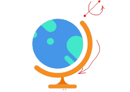

## 实验要求
本单元实验等级为高级(Advanced)，仅描述任务内容或类型，选做任务同学们根据个人精力与兴趣选择一个方向展开实验与验证。

1. **bumpmapping:** 学生需要使用实验提供的地球素材，完成法线贴图，。

2. **模型设计:** 给地球增加弧形支架与底座，运用**场景管理知识**，组合地球仪，并且定义各部件相对运动的坐标计算方式。参照下图，增加组合的球体旋转与支架摆动方式。  

3. 给场景增加纹理贴图的天空盒（球形、六面体），增加全局环境光，定义多个类型不同光源，验证地球仪组合运动情况下的贴图及光照渲染效果。

实验报告需呈现这三方面的实现方法与效果。

## 参考资料
[什么是法线贴图？](https://docs.unity3d.com/cn/2021.1/Manual/StandardShaderMaterialParameterNormalMap.html)  
[LearnOpenGL](https://learnopengl.com/Advanced-Lighting/Normal-Mapping)
