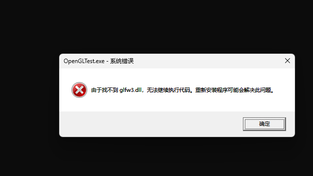
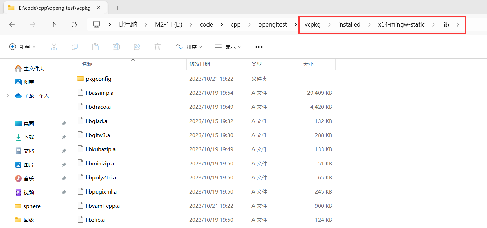

# Known Issues

When setting up your development environment, please be aware of the following issues:

1. **UCRT Version of MinGW**: The UCRT version of MinGW-w64 may cause compatibility issues. We recommend using the standard MinGW-w64 version without the `ucrt` flag. One can follow our [**installation guide in the same folder**](https://github.com/BOT-CG/CG-LAB/blob/main/%E5%AE%9E%E9%AA%8C%E6%8C%87%E5%AF%BC/%E7%8E%AF%E5%A2%83%E9%85%8D%E7%BD%AE/mingwInstallationGuide.md) to avoid this issue.

2. **CMake 3.28 Release Candidate**: The release candidate for CMake 3.28 has [*known issues with the zlib package*](https://discourse.cmake.org/t/3-28-0-rc-regression-vcpkg-error-building-zlib-x64-windows-failed-with-build-failed/9230). It is advised to use a stable release of CMake that is confirmed to work with zlib.


# 实验准备
本实验推荐使用vscode、cmake、vcpkg、mingw64等工具进行开发，下面对这些工具进行简单介绍。
## 基本开发环境

### Visual Studio Code (VSCode)

- **官网**: [VSCode官网](https://code.visualstudio.com/)
- **简介**: VSCode 是一个轻量级的代码编辑器，支持多种编程语言。它具有丰富的插件生态系统，以及强大的调试和集成终端选项。
- **安装**: 直接从官网下载安装。
>请学习[这个链接](https://code.visualstudio.com/docs/languages/cpp)完成cpp+mingw(或者msvc)的配置  
>请学习[这个链接](https://code.visualstudio.com/docs/cpp/cmake-linux)完成vscode cmake的配置


### [CMake](https://cmake.org/)
- **简介**: CMake 是一个开源的跨平台构建工具。它用于控制编译过程，使得代码可以独立于任何特定的编译器或平台。
### [MinGW64](http://mingw-w64.org/)
- **简介**: MinGW64 是一个用于 Windows 平台的 GCC 编译器和工具链。它允许你在 Windows 下使用 GNU 工具进行开发。

### vcpkg
vcpkg 是一个命令行工具，用于管理 C++ 库和依赖。它的工作原理相当简单：下载源码，编译它，并且把库和头文件安装到一个统一的目录中。这样你就可以非常方便地使用它们。

在[官网](https://vcpkg.io/)根据教程安装vcpkg

#### 基本命令

```bash
# 搜索可用库
vcpkg search [package-name]

# 安装库
vcpkg install [package-name]

# 删除库
vcpkg remove [package-name]

# 列出已安装的库
vcpkg list
```
上述命令中的 [package-name] 是你想要操作的库名。例如，要安装 GLFW 库，你可以使用 `vcpkg install glfw3` 命令。
#### 动态库与 DLL 缺失问题

如果在使用 vcpkg 安装库时没有指定 `static`，那么 vcpkg 会默认安装动态链接库（DLLs）。这种情况下，你的应用程序在运行时需要这些 DLL 文件。如果这些 DLL 文件没有放在与应用程序可执行文件（.exe）相同的文件夹内，或者没有被添加到系统的 PATH 环境变量里，你就可能会遇到 DLL 缺失的错误。 



>🐛  
>如果你打算分发你的应用程序，需要确保这些 DLL 文件与你的可执行文件一起分发，否则用户可能会遇到同样的问题。 


在学习或开发阶段，使用静态库通常更为方便。所有的库代码都会被包含在最终的可执行文件里，这样你就不用担心运行时依赖问题。
#### 配合mingw使用
```bash
# 使用 MinGW 可用的依赖库
vcpkg install [package-name]:x64-mingw-static
```
> ⚠️  
> 如果你不指定 --triplet 或者不添加其他信息，Vcpkg 默认会安装适用于 MSVC 的版本。这意味着如果你使用其他编译器（例如 MinGW、GCC 等），这些库将无法使用。而且默认安装动态库版本，可能遇到 DLL 缺失的问题。

> ✔️  
> 如果打算使用MSVC作为编译C++程序的工具链，使用以下命令
> 
> ```bash
>vcpkg install [package-name]:x64-windows-static
> ```
#### 参考资料
- [vcpkg官方文档](https://learn.microsoft.com/zh-cn/vcpkg/)
- [stackoverflow 关于mingw和vcpkg的讨论](https://stackoverflow.com/questions/63031513/vcpkg-with-mingw)
- [vcpkg三元组介绍](https://learn.microsoft.com/en-us/vcpkg/users/triplets)
## 依赖库介绍

### OpenGL

- **官网**: [OpenGL Official Site](https://www.opengl.org/)
- **简介**: OpenGL（Open Graphics Library）是一个跨平台的图形API，用于渲染2D和3D图像。它提供了一系列底层的渲染命令。
- **注意**: OpenGL 本身是一个规范，不同的硬件厂商会提供各自的实现。

### GLFW

- **官网**: [GLFW Official Site](https://www.glfw.org/)
- **简介**: GLFW 是一个专门为OpenGL设计的库，用于窗口管理、输入处理和事件处理。它提供了一个简化的API来创建窗口、读取输入等。
- **安装**: `vcpkg install glfw3:x64-mingw-static`

### GLAD

- **简介**: GLAD 是用于管理OpenGL的扩展加载的库。由于OpenGL是开放规范，不同的硬件可能会有不同的实现。GLAD用于解决这个问题，确保你可以使用各种不同的OpenGL扩展。
- **安装**:  `vcpkg install glad:x64-mingw-static`

### GLM


- **简介**: GLM（OpenGL Mathematics）是一个只有头文件的C++数学库，专门用于OpenGL。它提供了矩阵运算、向量运算等功能。
- **安装**: `vcpkg install glm:x64-mingw-static`

### Assimp


- **简介**: Assimp（Open Asset Import Library）是一个导入和导出多种3D模型格式的库。
- **安装**: `vcpkg install assimp:x64-mingw-static`

### yaml-cpp

- **官网**: [yaml-cpp GitHub Repository](https://github.com/jbeder/yaml-cpp)
- **简介**: yaml-cpp 是一个用于解析和生成YAML（Yet Another Markup Language）格式数据的C++库。
- **安装**: `vcpkg install yaml-cpp:x64-mingw-static`

### stb_image

- **官网**: [stb GitHub Repository](https://github.com/nothings/stb)
- **简介**: stb_image 是一个用于图像加载（如JPG, PNG等）的C库，它是单头文件库，易于集成。
- **安装**: `vcpkg install stb:x64-mingw-static`


安装完之后，可以在vcpkg目录下的installed目录下查看是否安装成功。具体目录是mingw还是windows取决于安装的时候triplet的设置。

